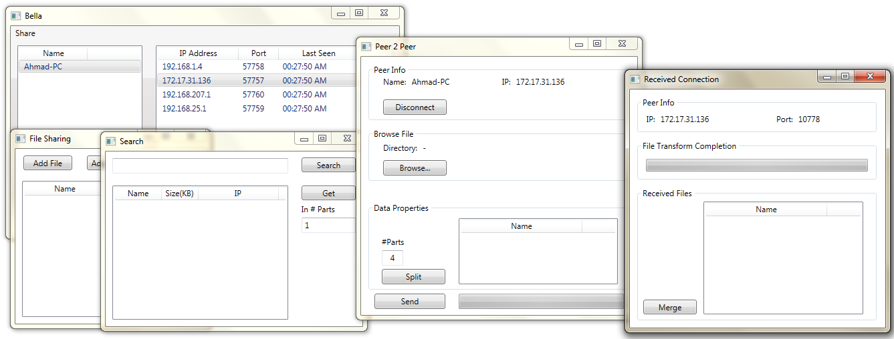

# Project Bella

Project Bella is a simple C# application developed in Visual Studio. It's designed to facilitate communication between computers within the same subnet using multicast as the NAT traversal approach. While the application itself is functional, it's worth noting that the source code may require improvements in terms of code readability and optimization.

## How to Use

**1. Setup:** Ensure that you have two or more computers within the same subnet. This is crucial for the application to work as intended.

**2. Multicasting Configuration:** Verify that your routers and network infrastructure are configured to pass multicast packets. Without proper multicast support, the application may not function correctly.

**3. Run the Application:** Start the Project Bella application on each of the computers within the subnet. You can typically do this by executing the application's binary or script.

**4. Exploring:** Once the application is running on multiple computers within the same subnet, you should be able to explore its functionality. Project Bella facilitates communication between these computers, but the exact use case and features may depend on the specific implementation.

## Note

While Project Bella provides a basic framework for communication within a subnet, it's important to consider the following:

- **Source Code Quality:** As mentioned earlier, the source code may require a complete revision for improved code readability and optimization, especially if you plan to use this application in a production environment.

- **Security:** Ensure that you understand the security implications of using multicast communication. Multicast packets can be received by all computers in the subnet, which may have privacy and security implications. Take appropriate measures to secure your network and the communication within it.

- **Compatibility:** Project Bella relies on multicast for NAT traversal. Ensure that your network environment and routers support multicast to make the application work effectively.

- **Customization:** Depending on your specific use case, you may need to customize Project Bella to suit your needs. This could involve modifying the codebase or adding additional features.

Please feel free to explore, experiment, and contribute to Project Bella as needed. Your contributions and improvements to the codebase are welcome.
